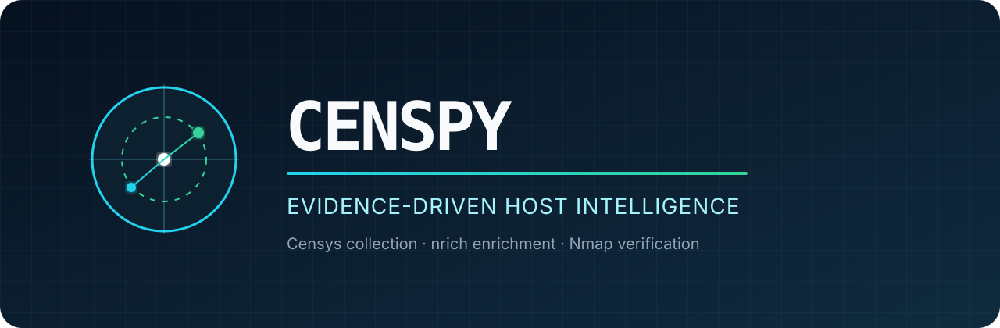
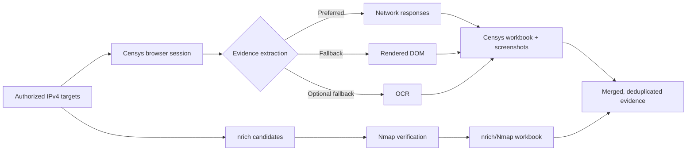

<div align="center">
  

  <p><strong>Turn authorized IP lists into reviewable, deduplicated host-intelligence evidence.</strong></p>

  [](https://github.com/Gix13/censpy/actions/workflows/ci.yml)
  
  
  
  [](LICENSE)
</div>

## Why Censpy exists

Host reconnaissance often leaves an analyst reconciling browser results, screenshots, enrichment data, and port-verification output by hand. Censpy coordinates that workflow: it gathers Censys host intelligence through a real browser session, preserves source evidence, enriches each target with `nrich`, verifies only the candidate ports with Nmap, and produces a unified workbook for review.

The project is intended for penetration testers, security engineers, and asset owners working from an approved target list. It favors traceable evidence and narrow verification over broad, unaudited scanning.

> [!CAUTION]
> Use Censpy only for assets you own, controlled labs, or systems covered by explicit written authorization. Respect provider terms, quotas, rate limits, and the engagement scope.

## Workflow



### What the pipeline produces

| Artifact | Purpose |
| --- | --- |
| `pics/` | Timestamped visual evidence from the Censys UI |
| `results_censys.xlsx` | Ports and DNS names extracted from Censys |
| `results_nrich.xlsx` | Candidate-first, Nmap-verified port results |
| `merged.xlsx` | One deduplicated record per IP across both sources |

Every run is written below `runs/<UTC timestamp>/`. Run directories are ignored by Git because they can disclose sensitive infrastructure.

## Capabilities

- Persistent Patchright/Chromium sessions for operator-controlled Censys access
- Three extraction paths: network response, rendered DOM, and optional OCR fallback
- Timestamped screenshots for later evidence review
- Local request-allowance tracking across authorized accounts
- `nrich` enrichment followed by targeted TCP/UDP Nmap verification
- Stable three-column evidence schema: `ip`, `ports/protocol`, and `dns`
- XLSX merge with deterministic port ordering and duplicate removal

## Repository layout

```text
.
├── censpy.py                         # End-to-end browser + enrichment workflow
├── scripts/
│   ├── nrich_nmap_orchestrator.py    # Standalone candidate verification tool
│   └── README.md
├── tests/                            # Offline parser and output tests
├── accounts.example.txt              # Placeholder credential-file format
├── ips.example.txt                   # Documentation-only target examples
└── requirements.txt
```

## Quick start

### 1. Install the Python environment

Requirements: Python 3.9+, Nmap, `nrich`, and a Censys account you are authorized to use.

```bash
python3 -m venv .venv
source .venv/bin/activate
python -m pip install --upgrade pip
python -m pip install -r requirements.txt
patchright install chromium
```

Install [Nmap](https://nmap.org/download) and [`nrich`](https://github.com/sa7mon/nrich) from their official projects or your operating system's package manager.

### 2. Create private local inputs

```bash
cp accounts.example.txt accounts.txt
cp ips.example.txt ips.txt
chmod 600 accounts.txt ips.txt
```

`accounts.txt` uses one entry per line:

```text
email:password:remaining_authorized_requests
```

`ips.txt` accepts one authorized IPv4 address per line. Credentials, targets, browser profiles, and run artifacts are excluded by `.gitignore`.

### 3. Run the complete workflow

```bash
python censpy.py
```

The browser remains visible so the operator can observe authentication, provider prompts, and each query.

## Standalone nrich/Nmap verifier

The verifier is useful when Censys evidence is not required. It asks `nrich` for candidate ports, checks only those ports with Nmap, and exports text, JSON, CSV, or XLSX.

```bash
python scripts/nrich_nmap_orchestrator.py \
  --targets-file ips.txt \
  --output-format json \
  --output-path results.json \
  --verbose
```

TCP verification uses a SYN scan when executed as root and a connect scan otherwise. UDP verification can be slow and may require elevated privileges. See [the component guide](scripts/README.md) for all flags.

## Practical use cases

- Correlate externally observed services during an authorized asset review
- Preserve browser-visible evidence alongside machine-readable results
- Confirm whether ports suggested by passive intelligence remain reachable
- Normalize two reconnaissance sources into an analyst-friendly workbook
- Feed a narrow, reviewed host inventory into later manual assessment work

## What Censpy is not

- It is not a comprehensive vulnerability scanner.
- Candidate ports are not vulnerabilities and still require analyst interpretation.
- It does not perform service-version detection, exploitation, or remediation validation.
- Browser selectors and response formats can change when Censys updates its interface.
- OCR is a last-resort convenience path and can misread rendered content.
- Multi-account support is for separately authorized accounts, never for bypassing quotas or access controls.

## Security and data handling

- Treat `accounts.txt` and every browser profile as credentials.
- Keep generated screenshots and workbooks inside the authorized engagement boundary.
- Review artifacts for tokens, customer identifiers, and infrastructure details before sharing.
- Prefer a dedicated Censys account and restrict credential-file permissions.
- Report vulnerabilities in this repository through the process in [SECURITY.md](SECURITY.md).

## Verification status

The publication copy is checked in CI with offline Python syntax tests and unit tests for the standalone parser/output logic. Browser automation, provider integrations, `nrich`, and Nmap require local installation and controlled-target validation; CI does not contact Censys or scan network targets.

## Provenance

Censpy was created by Gio Abou Sleiman as part of an offensive-security reconnaissance suite developed during a penetration-testing internship. This public edition is a sanitized portfolio copy: credentials, browser profiles, client targets, screenshots, and assessment results are intentionally excluded.
